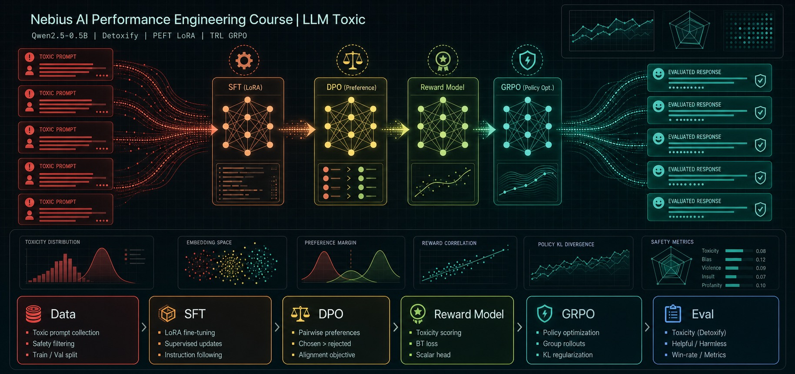

<p align="center">
  
</p>

<p align="center">
  <a href="https://www.python.org/"></a>
  <a href="https://jupyter.org/"></a>
  <a href="https://pytorch.org/"></a>
  <a href="https://huggingface.co/docs/transformers/index"></a>
  <a href="https://huggingface.co/docs/trl/index"></a>
  <a href="https://huggingface.co/docs/peft/index"></a>
</p>

# LLM Toxicity Post-Training Notebook

This repository contains a single Jupyter notebook for a controlled post-training homework experiment around toxicity evaluation, preference optimization, and reward hacking diagnostics. The notebook uses `Qwen/Qwen2.5-0.5B-Instruct`, LoRA adapters, Detoxify scoring, SFT, DPO, a Bradley-Terry reward model, and GRPO reward shaping.

The project is research/education oriented. Keep generated checkpoints and model outputs local unless you have a separate review process for sharing them.

## Contents

- `toxic_homework.ipynb` - end-to-end Python notebook with data preparation, training loops, evaluation helpers, and completed homework code cells.
- `docs/ARCHITECTURE.md` - architecture and data-flow notes for the notebook.
- `requirements.txt` - Python dependencies mirrored from the notebook setup cell.
- `assets/github-banner.jpg` - generated GitHub README banner.

## Python Setup

Use Python 3.10 or newer with a CUDA-capable environment for the full training path.

```bash
python -m venv .venv
source .venv/bin/activate
python -m pip install --upgrade pip
python -m pip install -r requirements.txt
```

Then open the notebook:

```bash
jupyter notebook toxic_homework.ipynb
```

The notebook caches derived JSONL datasets and checkpoints under `outputs_toxic/`.

## Workflow

1. Build Detoxify-filtered preference pairs from `Anthropic/hh-rlhf`.
2. Evaluate the base Qwen instruction model.
3. Train an SFT LoRA adapter on the flipped toxic side.
4. Train a DPO LoRA adapter initialized from SFT.
5. Train a LoRA-backed scalar reward model with Bradley-Terry loss.
6. Run GRPO with raw Detoxify, raw RM, and a shaped reward.
7. Compare greedy and K=16 sampled-support toxicity diagnostics.

See [docs/ARCHITECTURE.md](docs/ARCHITECTURE.md) for the component-level view.

## Nebius Automation

The `scripts/` directory contains SSH-based automation for running the notebook on a Nebius GPU VM and collecting evidence locally.

```bash
export NEBIUS_USER="ubuntu"
export NEBIUS_HOST="<vm-public-ip-or-dns>"
# export NEBIUS_SSH_KEY="$HOME/.ssh/id_ed25519"

scripts/nebius-run-all.sh
```

This performs three steps:

1. `scripts/nebius-deploy.sh` packages the project and uploads it to `NEBIUS_REMOTE_DIR` on the VM.
2. `scripts/nebius-run.sh` creates/reuses a remote `.venv`, installs `requirements.txt`, executes `toxic_homework.ipynb` with `jupyter nbconvert`, and records GPU/Python/package evidence.
3. `scripts/nebius-collect.sh` downloads the executed notebook, logs, environment snapshots, and file inventory into `evidence/nebius/<run-name>/`.

Use `scripts/nebius-env.example` as the configuration template. Collected evidence and `outputs_toxic/` are ignored by Git because they can be large.
